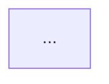

# LLXML

**LLM XML** - A hybrid XML+Markdown format optimized for AI-assisted development.

**Version:** 0.3.0  
**Date:** 2025-12-11

---

## Changelog

### v0.3.0 (2025-12-11)
- Added `ll.xml` project manifest format
- Added project structure specification (worktrees, META, ctx)
- Added unified scanning (categorize by root tag, not path)
- Added worktree-based vendoring (replaces ~/dev/lib/)
- Added META vs source distinction
- Added META versioning concept (Loom-managed)
- Added workspace export concept

### v0.2.0 (2025-12-10)
- Added `<ref>` as fifth file type for external reference material
- Clarified distinction between owned specs and read-only references

### v0.1.0 (2025-12-09)
- Initial release with four file types: `<app>`, `<library>`, `<skill>`, `<rules>`
- Type notation system (str, optional, arrays, maps)
- Structure guidelines and examples

---

## Philosophy

LLXML is designed for communication between humans and LLMs during software development. It prioritizes:

- **Token efficiency** - Terse tag names, minimal boilerplate
- **LLM comprehension** - Structure that models parse naturally
- **Human readability** - Clean enough to read and write by hand
- **Expressivity** - Flexible enough to describe any project

The format bends traditional XML rules where it makes sense. Markdown flows freely inside elements. Tag names are short. Structure serves communication, not schema validation.

---

## Project Structure

LLXML projects follow a standard directory layout using git worktrees:

```
~/dev/myproject/
├── ll.xml                 # Project manifest (at root, sibling to worktrees)
├── main/                  # Main branch worktree (development)
├── stable/                # Stable branch worktree (for vendoring)
├── _a/, _b/               # User bay worktrees (pattern: _[a-zA-Z])
├── wt/                    # Agent worktrees directory
│   ├── feature-x/
│   └── bugfix-y/
├── META/                  # Shared across worktrees, outside git
│   ├── spec/              # Architecture specs (<app>, <library>)
│   ├── skills/            # Project-specific skills
│   ├── rules/             # Project-specific rules
│   ├── objectives/        # Task planning files
│   ├── logs/              # Development logs
│   └── loom.toml          # Assembly profiles
└── ctx/                   # Assembled context output
```

### Key Concepts

- **Worktrees**: Multiple checkouts of the same repo for parallel work
- **META**: Shared development knowledge, outside version control, versioned by Loom
- **ctx**: Output directory for assembled context files
- **ll.xml**: Project manifest defining the structure

---

## ll.xml Manifest

The `ll.xml` file lives at the project root (sibling to worktrees) and defines the project structure:

```xml
<llxml>
  <repo path="main" />
  <worktrees path="wt" />
  <bays pattern="_[a-zA-Z]" />
  <meta path="META" />
  <ctx path="ctx" />
</llxml>
```

All fields have implicit defaults shown above. An empty `ll.xml` file works - it just signals "this is an LLXML project."

### Fields

| Field | Default | Description |
|-------|---------|-------------|
| `repo` | `main` | Path to the main git repository worktree |
| `worktrees` | `wt` | Directory for agent worktrees |
| `bays` | `_[a-zA-Z]` | Regex pattern for user bay worktrees |
| `meta` | `META` | Path to shared META directory |
| `ctx` | `ctx` | Path to assembled context output |

---

## Unified Scanning

LLXML files are categorized by their **root tag**, not by directory path. This means:

- Files can be organized however you want
- Loom scans META recursively for `.xml` files
- Each file's root tag determines its type: `<app>`, `<library>`, `<skill>`, `<rules>`, `<ref>`

Example - all valid, all discovered correctly:
```
META/
├── spec/loom.xml           # <app> - detected as architecture spec
├── skills/git-worktrees.xml # <skill> - detected as skill
├── my-stuff/random.xml      # <rules> - detected as rules
└── notes/axum-ref.xml       # <ref> - detected as reference
```

---

## META vs Source

LLXML files serve different purposes depending on where they live:

### META (Development-time)
- Architecture specs (`<app>`, `<library>`) - help agents understand the codebase
- Project-specific skills and rules
- Objectives and logs
- **Not shipped** - stays with the developer

### Source (Shipped)
- Consumer-facing skills - "how to use this library"
- Rules for consumers - "conventions when using this API"
- **Shipped when vendored** - travels with the code

**Rule of thumb**: If it helps *build* the thing, put it in META. If it helps *use* the thing, ship it in source.

---

## Worktree-based Vendoring

Projects share code via git worktrees instead of a separate library directory:

```
~/dev/http_api/
├── main/                  # Development
└── stable/                # Stable branch for vendoring
```

Consumers vendor from the stable worktree:
```bash
git submodule add file:///home/user/dev/http_api/stable vendor/http_api
```

Benefits:
- No separate `~/dev/lib/` directory
- "Publishing" is just merging to stable branch
- Single source of truth per project

---

## META Versioning

META is versioned by Loom (not git) using SQLite:

- Auto-snapshots on every file save
- Per-file history with timestamps
- Restore previous versions
- Stored at `$project/.loom/history.db`

This keeps META shared across worktrees while still having version history.

---

## Workspace Export

A Loom workspace can be exported as a minimal blueprint:

```
export/
├── llxml/
│   └── ll.xml
├── apps/
│   └── loom/
│       └── ll.xml
└── rust/
    └── http_api/
        └── ll.xml
```

Just the `ll.xml` manifests - the skeleton of the workspace. From this, you can reconstruct everything: clone repos, set up worktrees, vendor dependencies.

---

## File Types

LLXML defines five file types for organizing development knowledge:

- **`<app>`** - Architecture spec for a deliverable application
- **`<library>`** - Architecture spec for a shared dependency
- **`<skill>`** - Teachable process or capability
- **`<rules>`** - Coding conventions and constraints
- **`<ref>`** - External reference material (read-only knowledge)

**Projects** is the umbrella term for both apps and libraries - any codebase you're working on.

**References** are external code you study but don't own - cloned repos, example code, patterns to copy from.

## Universal Pattern

All LLXML files share a common header:

```xml
<name>identifier</name>
<desc>What it is or when to use it</desc>
```

- `<name>` - Short identifier (hyphen-case for skills)
- `<desc>` - Mission statement (apps/libraries) or usage trigger (skills/rules)

---

## Structure Guidelines

When writing LLXML specs, follow these principles for clarity:

### Group Types by Domain

Don't dump all types in a single `<types>` block. Group them semantically:

```xml
<types>
<users>
struct User { ... }
struct UserStatus { ... }
enum PresenceStatus { ... }
</users>

<teams>
struct Team { ... }
struct TeamMember { ... }
</teams>
</types>
```

### Name Each Data Flow

Each flow diagram should be in its own descriptively-named tag:

```xml
<data_flow>
<presence_sync>
```mermaid
sequenceDiagram
    ...
```
</presence_sync>

<notification_delivery>

</notification_delivery>
</data_flow>
```

### Group Features by Domain

Don't use flat feature lists. Organize by area:

```xml
<features>
<presence>
- Real-time online/offline status
- Custom status messages
</presence>

<notifications>
- @mentions across the team
- Status change alerts
</notifications>
</features>
```

### Read the Source Code

Specs should reflect actual implementation, not aspirations. Before writing a spec, read the actual source files to capture what exists.

---

## `<app>`

Architecture spec for a deliverable application - something you run.

### Required

- `<name>` - App identifier
- `<desc>` - Mission statement

### Recommended

- `<status>` - Development state (MVP, pre-launch, launched) and implications
- `<stack>` - Technologies used (languages, frameworks, databases)
- `<features>` - What it does, grouped by domain
- `<types>` - Data structures grouped by domain
- `<data_flow>` - Named mermaid diagrams showing how data moves
- `<constraints>` - Requirements and non-goals

### Freeform

Add domain-specific tags as needed:

- `<crates>` - Rust workspace structure
- `<api>` - API endpoints or protocols
- `<deps>` - Dependencies on other libraries/projects
- `<cli>` - Command-line interface

---

## `<library>`

Architecture spec for a shared dependency - something you consume.

### Required

- `<name>` - Library identifier
- `<desc>` - What it provides

### Recommended

- `<status>` - Development state and stability
- `<stack>` - Technologies used
- `<capabilities>` - What it enables for consumers
- `<types>` - Exported data structures grouped by domain
- `<data_flow>` - Named diagrams showing how data moves through the API
- `<dist>` - What it distributes (packages, crates, bindings)
- `<constraints>` - Requirements and non-goals

### Freeform

Add as needed:

- `<macros>` - Macro definitions and usage
- `<adapters>` - Pluggable backends
- `<bindings>` - Language bindings (WASM, FFI, etc.)

---

## `<skill>`

Teachable process or capability - something an LLM can learn to do.

### Required

- `<name>` - Skill identifier (hyphen-case)
- `<desc>` - When to use this skill

### Optional

- `<tools>` - Associated scripts, directories, or files
- `<allowed>` - Pre-approved tool calls
- `<steps>` - Numbered procedure if sequential

### Freeform

Structure however best expresses the process. Can include decision points, mermaid diagrams, examples.

### Example

```xml
<skill>
<name>objective-cycle</name>
<desc>Creating and iterating on objective files for task planning</desc>

<tools>
- META/objectives/ directory
- TodoWrite/TodoRead tools
</tools>

<steps>
1. Get timestamp: `date +"%Y%m%d-%H%M"`
2. Create file: `META/objectives/YYYYMMDD-HHMM-description.md`
3. Write objective with tasks as checkboxes
4. Iterate with user until approved
5. Execute tasks, marking complete as you go
6. Send completion notification
</steps>
</skill>
```

---

## `<rules>`

Coding conventions and constraints - how to write code in this context.

### Required

- `<name>` - Ruleset identifier
- `<desc>` - What these rules govern

### Recommended

- `<style>` - Formatting, naming conventions
- `<testing>` - How to write and run tests
- `<patterns>` - Encouraged approaches and idioms

### Freeform

Organize by domain using descriptive tags: `<async_patterns>`, `<error_handling>`, `<module_structure>`, etc.

### Example

```xml
<rules>
<name>rust-project</name>
<desc>Rust coding conventions for this project</desc>

<style>
- Format strings with variables inline: `println!("Result: {result}")`
- No emoji in code, comments, or logs
</style>

<testing>
- Unit tests in same file as implementation
- Integration tests in tests/ directory
- Run with: `cargo test`
</testing>

<patterns>
- Use CancellationToken for long-running async tasks
- Prefer unbounded channels for async communication
- Always handle errors explicitly
</patterns>
</rules>
```

---

## `<ref>`

External reference material - read-only knowledge you study but don't own.

Use `<ref>` for:
- Cloned GitHub repos to study (Axum examples, React patterns)
- ShadCN-style code you might copy from
- External libraries to reference but not depend on
- Documentation sources with your annotations

**Key distinction:** You never import, depend on, or modify a ref. It's curated pointers to external code with your notes about what's useful.

### Required

- `<name>` - Reference identifier
- `<desc>` - What it's useful for and when to consult it

### Recommended

- `<source>` - Path to the cloned/referenced code
- `<examples>` - Specific files worth studying
- `<patterns>` - Key patterns or idioms to learn from
- `<notes>` - Your annotations and insights

### Freeform

Add domain-specific tags as needed:

- `<api>` - API patterns worth copying
- `<architecture>` - Structural decisions to study
- `<gotchas>` - Pitfalls or non-obvious behaviors

### Example

```xml
<ref>
<name>axum</name>
<desc>Rust web framework - reference for routing, middleware, and WebSocket patterns</desc>

<source>META/ref/axum</source>

<examples>
- `examples/chat.rs` - WebSocket upgrade and broadcast pattern
- `examples/static-file-server.rs` - rust-embed integration
- `examples/error-handling.rs` - IntoResponse for custom errors
</examples>

<patterns>
- Router composition via `nest()` for modular route trees
- State extraction via `Extension<T>` or `State<T>`
- `FromRequest` trait for custom extractors
</patterns>

<notes>
Their error handling approach with `IntoResponse` is cleaner than
what we do in http_api. Consider adopting for v2.
</notes>
</ref>
```

---

## LLXML Types

LLXML uses a terse hybrid notation for data structures, drawing from Rust and TypeScript while optimizing for readability and token efficiency.

### Structs

Define data structures with fields and types:

```
struct User {
    id: i64,
    name: str,
    email: str,
    created_at: i64,
}
```

### Enums

Define variants - simple, tuple, or struct-style:

```
enum Status {
    Pending,
    Active,
    Suspended { reason: str, until: i64 },
}

enum Message {
    Text(str),
    Image { url: str, width: i32, height: i32 },
    File(str, i64),
}
```

### Optional Fields

Use `?` before the colon to mark optional fields:

```
struct Profile {
    id: i64,
    name: str,
    avatar?: str,
    bio?: str,
    verified_at?: i64,
}
```

This replaces `Option<T>` - cleaner and immediately visible.

### Arrays

Use `[]` suffix on the type:

```
struct Playlist {
    id: i64,
    name: str,
    tracks: Track[],
    tags: str[],
}
```

This replaces `Vec<T>` - familiar from TypeScript/JSON.

### Maps

Use `->` to show key-value mapping:

```
struct Config {
    settings: str -> str,
    permissions: str -> bool,
    metadata: str -> Value,
}
```

This replaces `HashMap<K, V>` - the arrow visually indicates "key points to value".

### Primitive Types

Use short, lowercase type names:

- `str` - string (not `String`)
- `i32`, `i64` - signed integers
- `u32`, `u64` - unsigned integers
- `f32`, `f64` - floats
- `bool` - boolean
- `any` - dynamic/unknown type
- `u8[]` - byte array

### What to Avoid

**Newtype wrappers** - Just use the primitive:
```
struct UserId(str)     # Avoid
id: str                # Use this instead
```

**Rust memory types** - These are implementation details:
```
Arc<T>, Rc<T>, Box<T>, Cow<T>, RefCell<T>, Mutex<T>   # Never use
```

**Rust collection types** - Use the terse syntax:
```
Option<str>        # Use: field?: str
Vec<Item>          # Use: items: Item[]
HashMap<str, i32>  # Use: counts: str -> i32
```

---

## General Styling

- **Markdown inside XML** - Lists, emphasis, code blocks flow naturally
- **Terse tag names** - `<stack>` not `<technology_stack>`
- **Flat structure** - Nest only when semantically meaningful
- **No attributes** - Use nested elements instead of XML attributes
- **Domain-specific tags** - Invent tags that describe your content

---

## Why LLXML?

Traditional documentation formats have tradeoffs:

- **Pure Markdown** - No structure, hard to parse programmatically
- **Pure XML/JSON** - Verbose, painful to write by hand
- **YAML** - Indentation-sensitive, limited nesting

LLXML takes the best of each:

- XML provides clear boundaries and hierarchy
- Markdown provides natural prose and lists
- Short conventions reduce token overhead
- Flexibility allows domain-specific expression

The result is documentation that's easy to write, easy to read, and easy for LLMs to understand and act upon.
